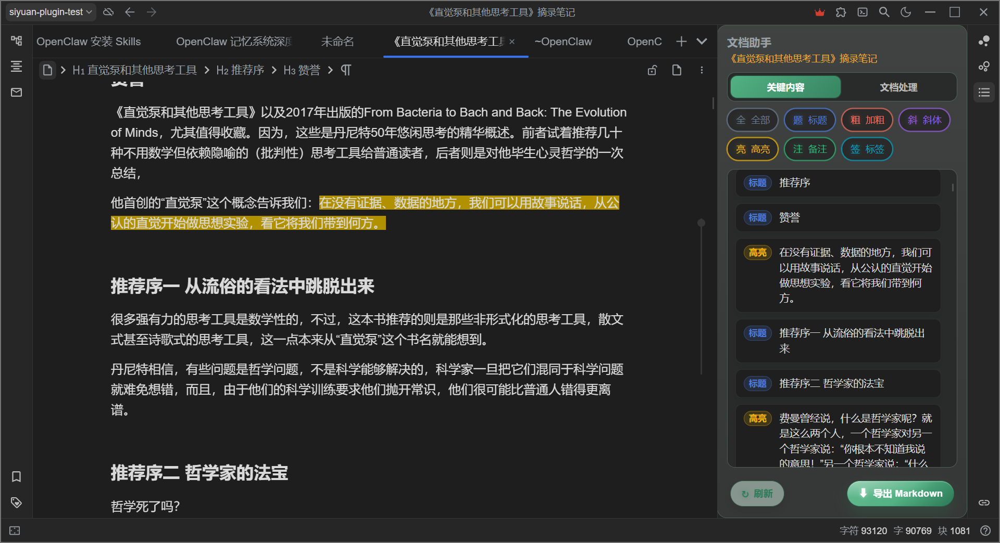
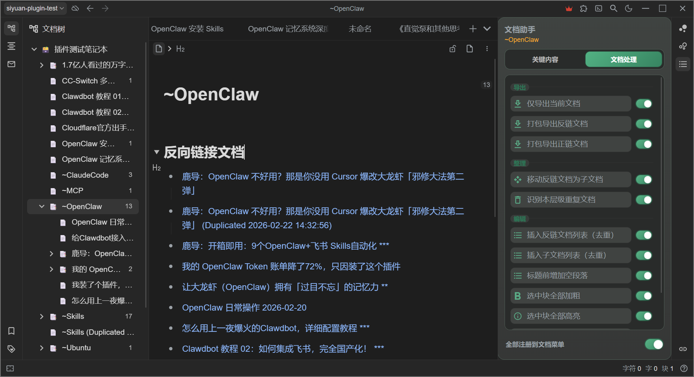

# 思源笔记文档助手已上线集市，协助你整理笔记的好帮手

# 思源笔记文档助手 siyuan-doc-assist

思源笔记文档助手 siyuan-doc-assist 是一个思源笔记插件，用于增强思源笔记本体未提供的文档处理和编辑功能。

- 插件 ID：`siyuan-doc-assist`
- 展示名称：`文档助手 / Doc Assist`
- 最低思源版本：`3.5.7`
- 当前版本：`1.2.0`

## 功能总览

插件安装后会生成一个侧边栏，目前主要提供两大类功能：

### 1. 关键内容

- 自动提取文档中加了标记的关键内容：标题、加粗、斜体、高亮、备注、标签；
- 支持类型多选筛选、手动刷新；
- 点击条目可在当前文档中平滑定位到对应块；
- 支持将当前筛选结果导出为 Markdown；

多说一句，集市里有一个叫“关键信息导航”的插件，提供类似的功能。但我试用了有问题，很多文档的加粗内容显示不全，顺序跟原文也不一致，好像还不支持导出，作者也有几个月没更新了，所以就自己折腾一个。

### 2. 文档处理

- **导出：仅导出当前文档、打包导出反链文档、打包导出正链文档；**

  当前思源笔记已经内置了是否导出关联文档的配置项，但我有多种导出需求，又嫌更改配置太麻烦，现在就可以两全其美了。

  使用思源笔记内置导出功能可以打包导出关联文档，而通过文档助手可以仅导出单文档，或者仅打包导出正链文档，或仅打包导出反链文档。
- **整理：移动反链为子文档、识别本层级重复文档；**

  移动反链文档为子文档：是为了方便整理笔记归类，大多数时候我就用链接关联四散的笔记文档，但对于某一个准备深入研究的主题，我还是习惯把关联文档都作为子文档，放在主题笔记节点之下。

  识别本层级重复文档：也是为了整理方便，有时候从公众号、头条号不同数据源采集了很多文章准备有空了慢慢看，难免会发生保存了重复文档的情况，使用这个功能可以帮助简单识别。识别出来后可以全部打开对比，再删除冗余。
- **编辑：插入反链/子文档列表、去除空段落、标题前补空段落、删除从当前段到文末、选中块批量加粗/高亮**

  这里造了几个我认为可以方便日常整理笔记的功能，由于思源笔记本体没有提供，所以就自己操刀了。

  插入反链和插入子文档列表：这个功能其他插件也有，我增加了一个去重比较的体验改进点，每次只插入文档正文中未包含的关联文档链接。我自己整理的主题笔记，通常都包含了有层次关系的链接，但笔记是慢慢积累的，如果每次都全量插入关联文档链接，从头整理层次关系太费劲了，所以只插入新文档链接，只做增量整理。

  其他几个编辑功能，如去除空段落、删除从当前段到文末、选中块批量加粗等，我自己觉得挺好用。

## 使用入口

- 命令面板：可执行全部插件命令
- 编辑器标题菜单：可直接执行文档处理动作
- 右侧 Dock 面板：提供“关键内容 / 文档处理”双标签页

说明：

- 支持在 Dock 面板中按动作开启或关闭“注册到文档标题菜单”
- 部分动作为桌面端限定，移动端会自动置灰并给出提示
