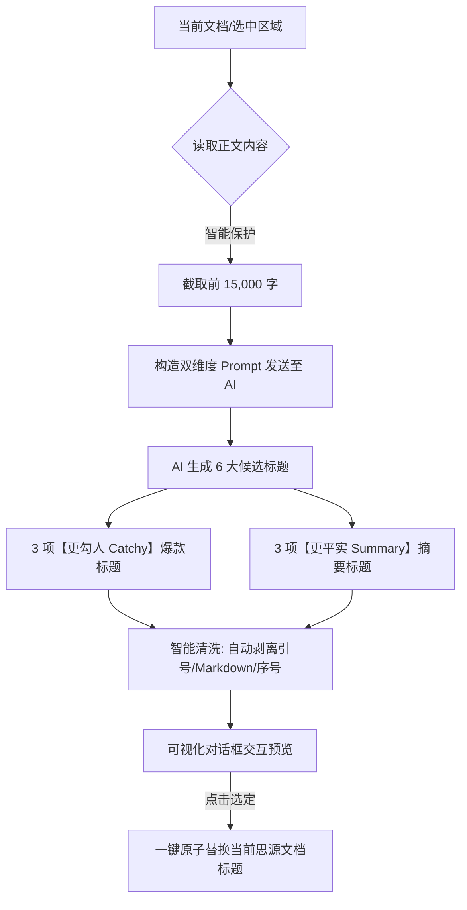

# 思源文档助手新功能指南：悬浮选中文本与 AI 标题重构

> **项目**：`siyuan-doc-assist`（思源文档助手）  
> **面向对象**：思源笔记用户、知识管理爱好者、内容创作者、研发与翻译人员  
> **核心目标**：深入解析插件两大全新功能的**真实使用场景**、**解决的核心痛点**与**用户价值**。

---

## 1. 悬浮选中文本（OS 级独立置顶与透明便签）

### 1.1 痛点与问题根源

在日常知识管理与数字化办公中，用户经常遇到以下两类典型痛点：

1. **频繁切换窗口打断专注流**：在将思源笔记中的资料对比输入到第三方软件（如 VSCode、Word、Excel、浏览器或译员软件）时，一旦点击第三方软件，思源笔记窗口便退入系统后台，导致用户必须频繁进行 `Alt + Tab` 切换。
2. **常规内嵌浮窗（In-App Popover）失效**：大部分笔记插件采用网页 DOM (`position: fixed`) 方案实现悬浮窗，当思源笔记主窗口最小化或失去焦点时，浮窗仍会被第三方应用程序强行遮挡。

### 1.2 典型用户使用场景

#### 场景 A：跨软件对比写作与代码编写
* **情境**：程序员在思源笔记中整理了 API 设计规范或算法伪代码，需要在 IDE（VSCode/IntelliJ）中实现；或者学者在思源中整理了英文参考文献，需要在 Word 中撰写中文论文。
* **操作**：在思源笔记中选中关键段落，右键或点击工具栏“📌 悬浮选中文本”。
* **体验**：选中的内容瞬间生成一个跨应用的窗口，始终保持在屏幕最前。用户可以直接在 IDE 或 Word 中畅快打字，无需再来回切换应用。

#### 场景 B：网络剪藏与多源资料对照翻译
* **情境**：翻译人员或阅读者需要将外文笔记翻译为中文，或者对比两篇不同来源的剪藏文章。
* **操作**：将原文段落悬浮置顶，并调至半透明磨砂模式，叠放在目标编辑区旁边。
* **体验**：实现实时逐句对照，眼不离屏，翻译与对比效率大幅提升。

#### 场景 C：桌面轻量级透明便签与临时记忆
* **情境**：在日常工作中，有临时需要盯紧的 Task 列表、会议要点或代码 Command 指令。
* **操作**：选中文本后置顶悬浮，快捷使用 `Ctrl + 滚轮` 调节字号，并将透明度调整至约 30%。
* **体验**：便签如水印般自然融入桌面背景，既不遮挡下方浏览网页的内容，又随时可查。

### 1.3 解决方案与核心特性

| 功能特性 | 技术细节与解决方案 | 用户价值 |
| :--- | :--- | :--- |
| **OS 级独立全局置顶** | 采用思源桌面 Native 独立窗口 (`setAlwaysOnTop`) 与 Document Picture-in-Picture 适配技术，摆脱网页 DOM 限制。 | 真正的全局置顶，被第三方软件覆盖时依然稳定漂浮在最顶层。 |
| **磨砂玻璃半透明调节** | 结合 `background: rgba(...)` 与 `backdrop-filter: blur(12px)`，支持 10%~100% 透明度滑动微调。 | 既能透视下方窗口背景，又保证悬浮文字本身高对比度清晰易读。 |
| **直观的缩放与快捷交互** | 监听 `Ctrl + 鼠标滚轮` 实时放大/缩小字体；支持 `Esc` 一键快速收起退出。 | 无需繁琐的设置菜单，符合直觉的极简交互操作。 |
| **多维入口与智能降级** | 选中文本工具栏、选区右键菜单、文档右键菜单、Dock 分组按钮全覆盖；未选中文本时**自动降级悬浮整篇文档**。 | 随时随地一键悬浮，无需担心“未选中文本无法使用”的尴尬。 |
| **状态记忆与视图切换** | 自动记忆窗口尺寸与坐标；支持一键切换“纯文本模式”与“Markdown 渲染视图”（支持加粗、代码块、待办列表等格式）。 | 关掉重新打开依然保持习惯样式，满足不同内容格式的呈现需求。 |

---

## 2. AI 生成更好的标题（智能标题重构与提炼）

### 2.1 痛点与问题根源

1. **剪藏文章“标题党”信息密度极低**：通过网页剪藏插件保存到思源笔记的文章，往往充斥着“震惊！他竟然做出了这个决定”、“看完这篇文章大家都沉默了”等吸引眼球但缺乏实质信息的标题。日后在知识库中全局搜索或目录浏览时，完全无法通过标题获取文章的核心价值。
2. **“起名废”与随意命名**：写作或记录会议纪要时，随手填写“新建文档”、“未命名”、“关于项目的思考”，随着笔记增多，检索难度呈指数级上升。
3. **自媒体与公开发布缺乏吸引力**：撰写完优质文章准备发布到公众号、知乎、小红书或博客时，苦于写不出具备强好奇心与传播力的“钩子”标题。

### 2.2 典型用户使用场景

#### 场景 A：网络剪藏文章治理与知识库规范化重构（推荐）
* **原标题**：《震惊！全网都在传的这个秘密，终于被揭开了！》
* **痛点**：隔天在思源笔记检索时，输入关键词搜索不到，全局浏览时也无法判断内容。
* **AI 重构后**：选择【更平实 (Summary)】候选方案 —— **《2026 年前端构建工具 Vite 6 核心架构演进与性能优化指南》**。
* **价值**：将无价值的垃圾标题一键重构为**高信息密度、利于检索、结构清晰**的规范知识库文档标题。

#### 场景 B：自媒体与公开发布打磨“爆款标题”
* **原标题**：《我使用 TypeScript 替换 JavaScript 的一些心得》
* **需求**：希望发布到技术社区吸引更多读者阅读讨论。
* **AI 重构后**：选择【更勾人 (Catchy)】候选方案 —— **《重构 5 万行代码后，我为什么劝你彻底放弃原生 JS？》**。
* **价值**：利用内置的启发式 Prompt 算法，自动生成自带悬念与好奇心钩子的候选标题，大幅提高文章点击率与传播力。

#### 场景 C：长文提炼与会议纪要归档
* **情境**：在思源笔记中记录了一份长达数千字的讨论记录或读书笔记，一时难以概括。
* **操作**：使用“AI 生成更好的标题”，AI 自动阅读前 15,000 字正文，给出 3 个精准提炼的核心摘要标题。
* **价值**：一秒提取长文主旨，省去手动重新阅读总结的繁琐过程。

### 2.3 解决方案与核心特性

| 核心特性 | 技术细节与解决方案 | 用户价值 |
| :--- | :--- | :--- |
| **双向双维度候选推荐** | 同时输出 **3 个“更勾人 (Catchy)”**（悬念、引人好奇）和 **3 个“更平实 (Summary)”**（精准概括、语言质朴）标题。 | 一次生成同时满足“公开发布”与“知识库归档”两种截然不同的需求。 |
| **上下文与长文安全保护** | 智能读取原标题与正文；当正文超长时自动触发 `15,000` 字截断保护（`prepareBetterTitlesInputText`）。 | 确保 AI 充分理解全文上下文的同时，避免超大 Token 消费或接口报错。 |
| **鲁棒的格式智能清洗** | 正则自动过滤 Markdown 加粗/代码块标记，剥离开头序号（如 `1.`、`标题一：`）与两端引号（`cleanCandidateTitle`）。 | 输出干净、规范的标准标题，无需用户二次手删序号或符号。 |
| **一键替换与优雅交互** | 提供结构化的卡片对话框，展示原标题与 6 个候选方案；用户只需轻点一下即可更新思源内核文档标题。 | 零学习成本，即点即用，极大地简化了文档重命名工作流。 |

---

## 3. 功能对比与总结

| 维度 | 悬浮选中文本 | AI 生成更好的标题 |
| :--- | :--- | :--- |
| **关注点** | 文本对照、跨应用工作流、专注体验 | 文档检索、信息密度治理、内容传播 |
| **主要触发方式** | 工具栏图标、选区右键、快捷键 | 文档/选区右键菜单、AI 辅助动作 |
| **核心解决问题** | 窗口频繁切换、多应用参考遮挡 | 剪藏标题党治理、起名废、检索效率低下 |
| **典型代表场景** | 翻译对照、边看边写代码/Word、桌面便签 | 剪藏清理、自媒体取标题、知识库整理 |

---

## 4. 快速上手指南

1. **开启悬浮文本**：在任意思源文档中选中目标文字，点击悬浮工具栏上的 **📌 悬浮选中文本** 图标，或右键选择“悬浮选中文本”。
2. **调节透明度与字号**：在打开的悬浮窗口顶部使用滑动条调节背景透明度，按住 `Ctrl` 滚动鼠标滚轮放大或缩小字号。
3. **生成更好标题**：右键点击文档标题或编辑区，选择 **AI 辅助 -> 更好的标题**，系统将弹出可视化对话框，展示“更勾人”与“更平实”两组候选方案，点击满意的标题即可直接生效。
